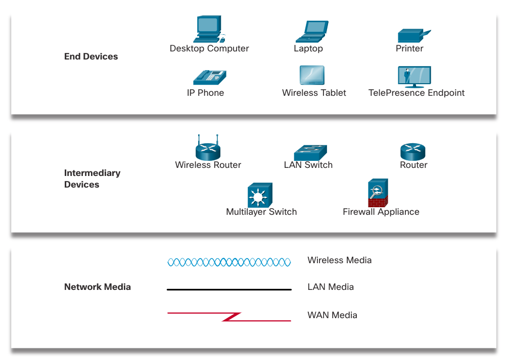

# My Home Network

## Overview
A list of the components that make up my homenetwork

## Details
| Type          | Device Description | Device Name | Location |
| :------------ | :----------------: | :---------: | :------: |
| End Device    | Work Laptop (New)  | (TBD)       | Upstairs Office |
| End Device    | Work Laptop (Old)  | (TBD)       | Upstairs Office |
| Intermediary  | 
| Network Media |   

## References

